<h1 align="center">vScan</h1>

  <strong>Desktop Vulnerability Scanner for Veeam Backups</strong>

  
  
  

---

**vScan** is a desktop application that scans Veeam Backup & Replication restore points for known vulnerabilities. It mounts VM backups via Veeam's Data Integration API on a remote Linux server, scans them using industry-standard tools (Trivy, Grype, or Jadi), and tracks vulnerability lifecycle over time.

## Features

- **Single & Batch Scanning** -- Scan one VM or multiple VMs in parallel with configurable concurrency
- **Scheduled Scans** -- Cron-based scheduling with timezone support and automatic catch-up
- **Three Scanners** -- Trivy (Linux/containers), Grype (multi-language/SBOM), and Jadi (Windows/.NET)
- **Vulnerability Lifecycle** -- Track open, fixed, won't fix, accepted, and false positive statuses with detection history
- **Point-in-Time Comparison** -- Compare vulnerability state between restore points or scanners
- **CISA KEV Integration** -- Automatic flagging of Known Exploited Vulnerabilities with 24h sync
- **PDF & CSV Reports** -- Executive summary and technical reports with custom branding (logo, company name, colors)
- **Dashboard** -- Real-time severity trends, most vulnerable servers, KEV alerts, and scan statistics
- **Security** -- Master password with Argon2id + AES-256-GCM, biometric unlock (Touch ID / Windows Hello), auto-lock
- **Email & Desktop Notifications** -- SMTP alerts and native OS notifications for scan events
- **System Tray** -- Background operation with tray icon, quick access menu, and notification badges
- **Scanner Management** -- Install, update, and uninstall scanners directly from the UI with SHA-256 verification

## Screenshots

  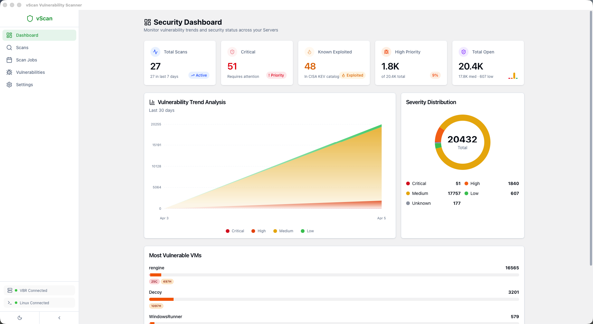

More screenshots

| Scan Wizard | Scan Results |
|:-----------:|:------------:|
| 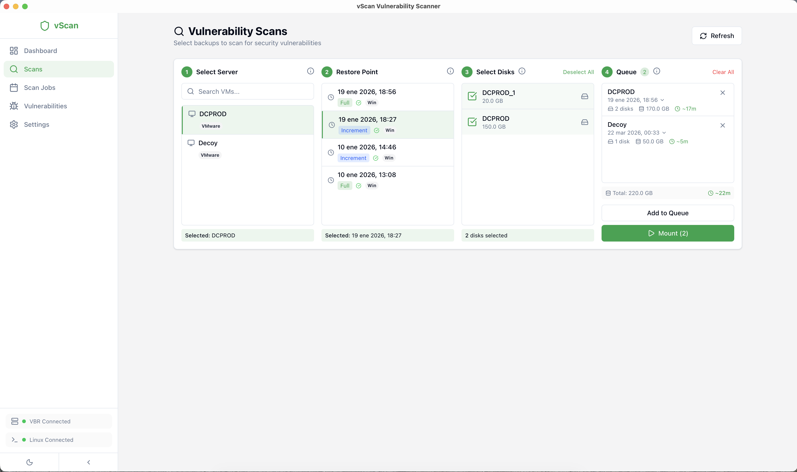 | 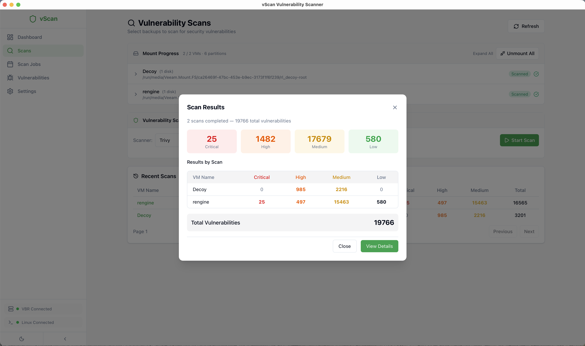 |

| Vulnerabilities | Vulnerability Details |
|:--------------:|:--------------------:|
| 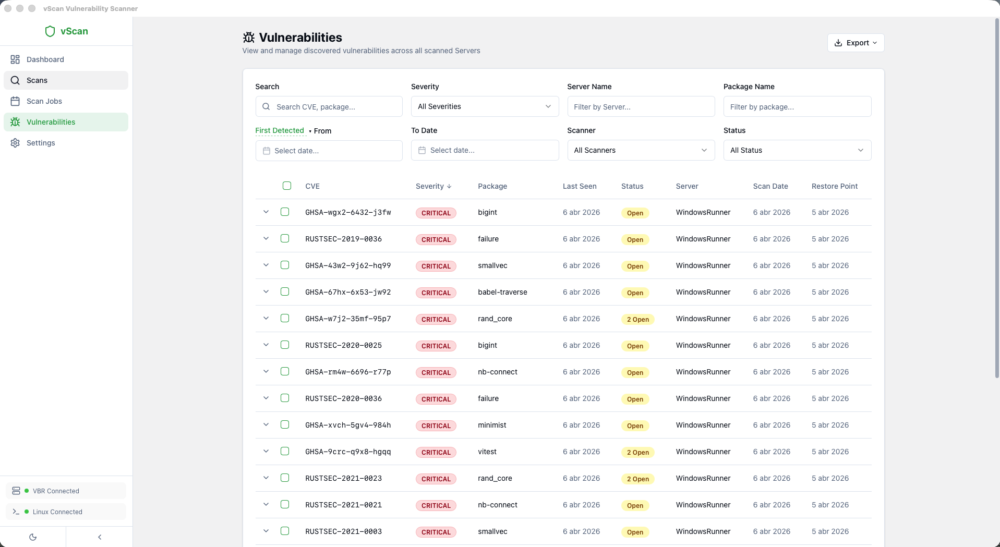 | 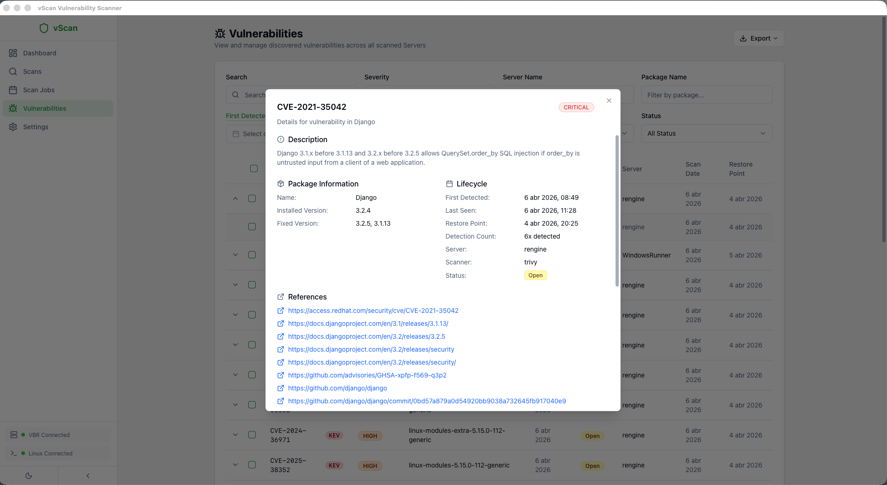 |

| Batch Scanning | Batch Progress |
|:--------------:|:--------------:|
| 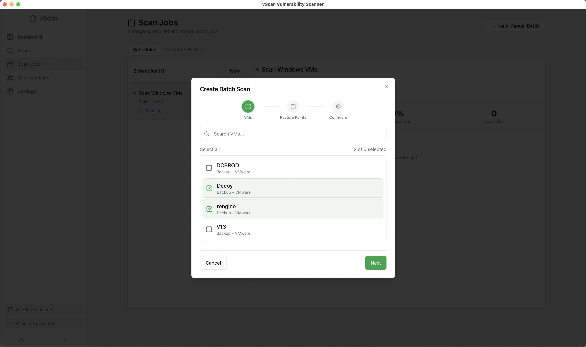 | 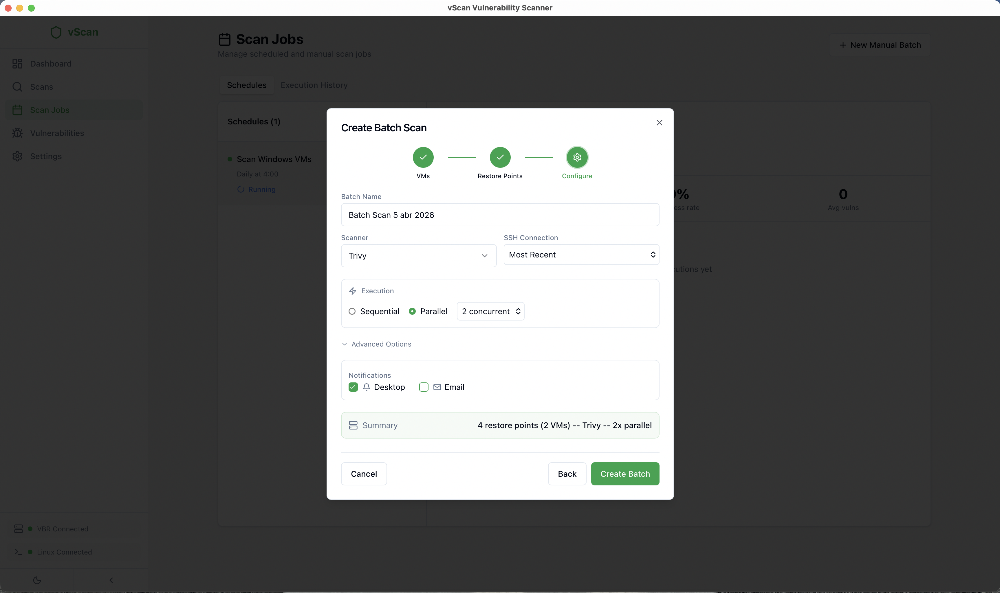 |

| Scheduled Scans | Point-in-Time Comparison |
|:---------------:|:------------------------:|
| 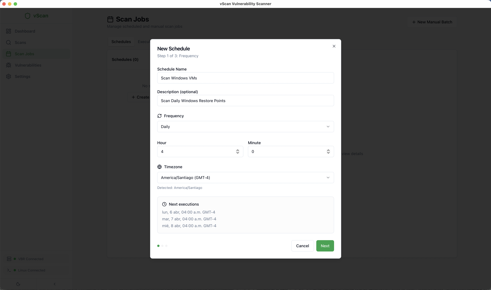 | 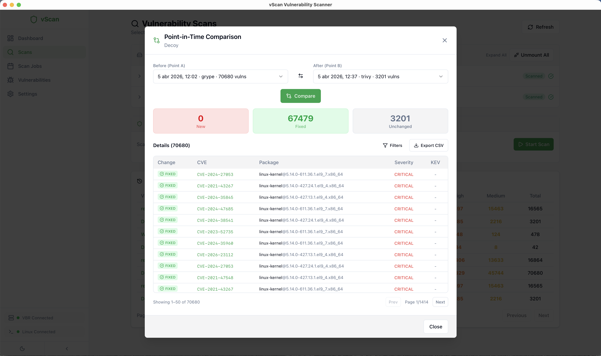 |

| Settings | Security |
|:--------:|:--------:|
| 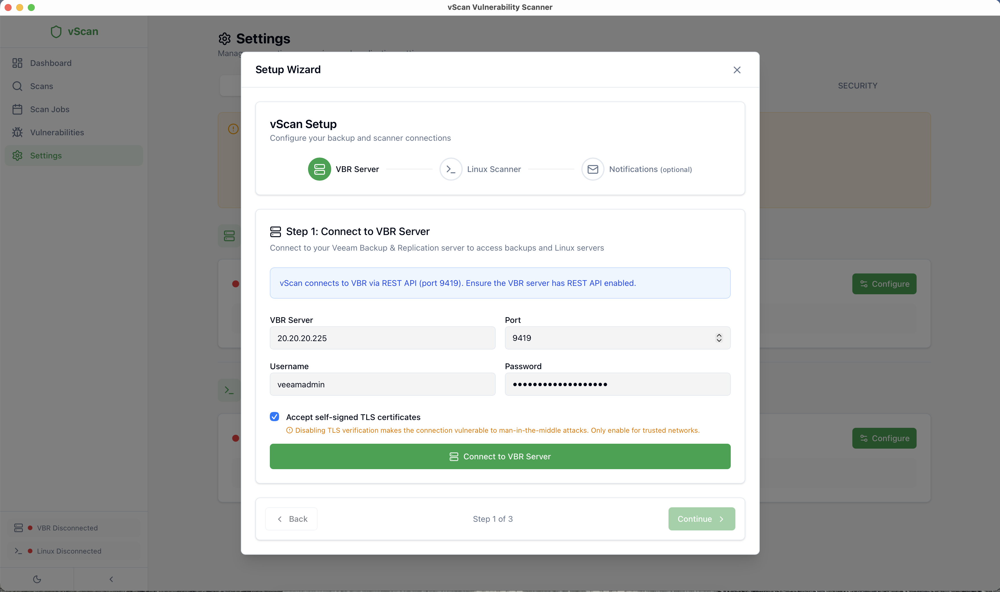 | 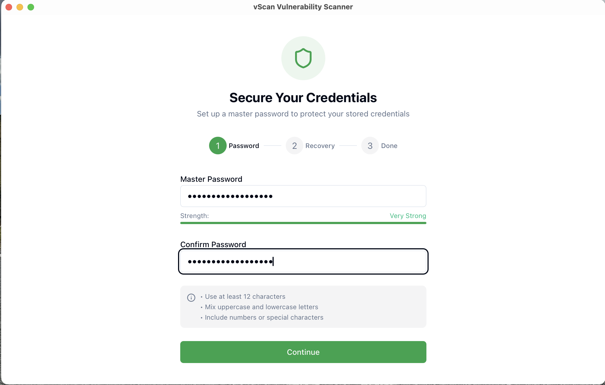 |

| Report Branding | KEV Catalog |
|:---------------:|:-----------:|
| 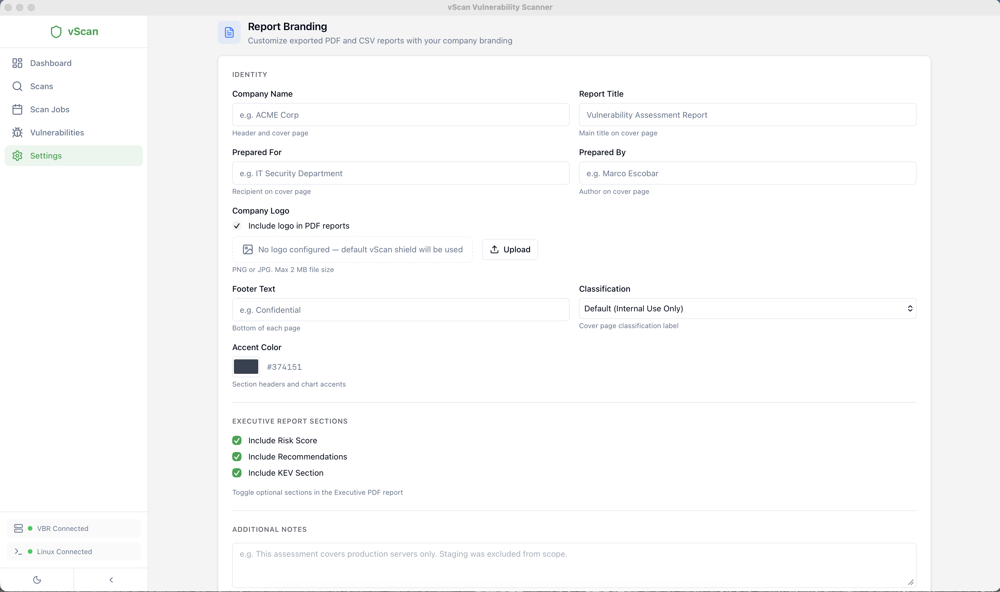 | 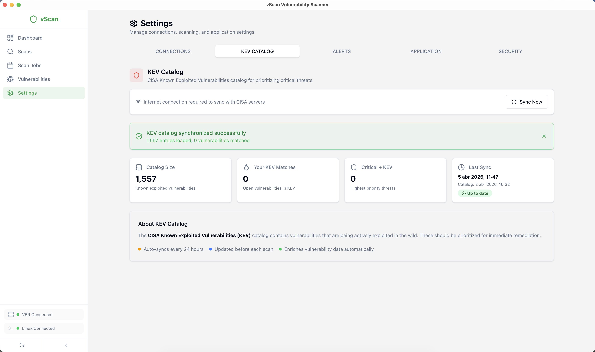 |

## Requirements

### vScan Desktop App

| | macOS | Windows |
|---|---|---|
| **Minimum version** | 13.0 (Ventura) | 10 (1803+) |
| **Verified** | Ventura 13, Sonoma 14, Sequoia 15, Tahoe 26 | Windows 10, 11, Server 2019/2022/2025 |
| **Architecture** | Apple Silicon (arm64) | x86_64 |
| **Installer** | `.dmg` | NSIS `.exe` |
| **Biometrics** | Touch ID, Face ID | Windows Hello |
| **Credential store** | macOS Keychain | Windows Credential Manager |

### Veeam Infrastructure

- **Veeam Backup & Replication v13** or later with REST API enabled (port 9419)
- At least one VM backup with a restore point

### Linux Scanner Server

- **Rocky Linux 9+** with SSH enabled
- Minimum specs: 2 CPU cores, 4 GB RAM, 20 GB free disk space
- Required packages (auto-installed by vScan): FUSE, NTFS-3G
- Scanners (auto-installed by vScan): Trivy, Grype, and/or Jadi

### Supported Backup Platforms

| Platform | Status |
|----------|--------|
| VMware vSphere | Supported |
| Microsoft Hyper-V | Supported |
| VMware Cloud Director | Supported |
| Nutanix AHV | Supported |
| Proxmox VE | Supported |
| oVirt KVM / OLVM / RHV | Supported |
| Scale Computing HyperCore | Supported |
| HPE Morpheus VM Essentials | Supported |
| AWS EC2 | Supported |
| Microsoft Azure VMs | Supported |
| Google Cloud Instances | Supported |
| Kasten Policies | Supported |
| Veeam Agent for Windows | Supported |
| Veeam Agent for Linux | Supported |
| Veeam Agent for Mac | Supported |
| Veeam Agent for Oracle Solaris | Supported |
| Veeam Agent for IBM AIX | Supported |

## Installation

Download the latest release for your operating system:

| Platform | Download |
|----------|----------|
| **Windows** (x64) | [vScan-Setup.exe](https://github.com/VeeamHub/veeam-vscan-security/releases/latest) |
| **macOS** (Apple Silicon) | [vScan.dmg](https://github.com/VeeamHub/veeam-vscan-security/releases/latest) |

## Quick Start

1. **Install vScan** on your workstation
2. **Set Master Password** on first launch and save your recovery key securely
3. **Connect to VBR** -- Enter your Veeam Backup server address and credentials
4. **Add Linux Scanner** -- Provide SSH access to your Linux server (vScan auto-installs scanners)
5. **Select a VM** -- Choose from your Veeam backup inventory
6. **Pick a Restore Point** -- Select which backup snapshot to scan
7. **Scan** -- vScan mounts the backup, runs the scanner, and shows results

See the [Getting Started Guide](docs/en/GETTING-STARTED.md) for detailed instructions.

## How It Works

1. **Mount** -- vScan uses the Veeam Data Integration API to publish a restore point on the Linux scanner server
2. **Scan** -- Trivy, Grype, or Jadi scans the mounted filesystem for known vulnerabilities (CVEs)
3. **Track** -- Results are stored locally with lifecycle tracking (new, fixed, reopened)
4. **Report** -- Generate PDF/CSV reports, compare restore points, track trends over time

## Documentation

| Language | Documents |
|----------|-----------|
| **English** | [Overview](docs/en/README.md) · [Installation](docs/en/INSTALLATION.md) · [Getting Started](docs/en/GETTING-STARTED.md) · [User Guide](docs/en/USER-GUIDE.md) · [Scanners](docs/en/SCANNERS.md) · [FAQ](docs/en/FAQ.md) |
| **Espanol** | [Overview](docs/es/README.md) · [Instalacion](docs/es/INSTALACION.md) · [Inicio Rapido](docs/es/INICIO-RAPIDO.md) · [Guia de Usuario](docs/es/GUIA-USUARIO.md) · [Scanners](docs/es/SCANNERS.md) · [FAQ](docs/es/FAQ.md) |

## Security

vScan encrypts all stored credentials with **AES-256-GCM** and derives encryption keys using **Argon2id**. Supports **Touch ID** and **Windows Hello** for quick unlock. All data stays local -- no telemetry or external reporting.

## Contributions

We welcome contributions from the community! We encourage you to create [issues](https://github.com/VeeamHub/veeam-vscan-security/issues/new/choose) for Bugs & Feature Requests and submit Pull Requests. For more detailed information, refer to our [Contributing Guide](CONTRIBUTING.md).

## License

MIT License -- see [LICENSE](LICENSE) for details.

## Author

**Marco Escobar** -- [mescobarcl](https://github.com/mescobarcl)

- Website: [24xsiempre.com](https://24xsiempre.com)

---

  vScan is not affiliated with or endorsed by Veeam Software.

